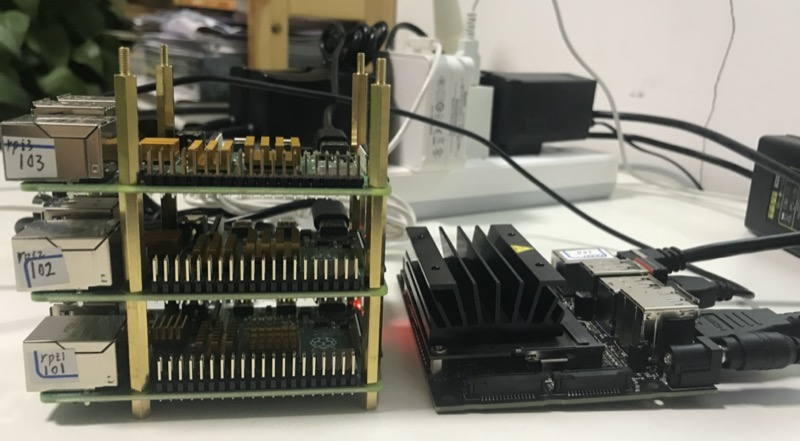

# Cloud Lab

## Edge
### [硬件](hardware)
| 主机                                                                            | 内存   | 电源存储容量 | 适配器 | 散热片 | 高清接口  |　Wi-Fi蓝牙 |
| :---                                                                           | ----:  | ----:      | ---: | ---: | ---:      | ---: |
| 小主机x86 | 8G | 128G | 12V5A | 自带 | HDMI | 自带 |
| [Raspberry Pi 4](https://www.raspberrypi.org/products/raspberry-pi-4-model-b/) | 4G     | 32G        | 5V3A | 无   | Micro HDMI | 自带 |
| [Raspberry Pi 4](https://www.raspberrypi.org/products/raspberry-pi-4-model-b/) | 4G     | 32G        | 5V3A | 无   | Micro HDMI | 自带 |
| [Raspberry Pi 4](https://www.raspberrypi.org/products/raspberry-pi-4-model-b/) | 4G     | 32G        | 5V3A | 无   | Micro HDMI | 自带 |
| [Jetson Nano B01](https://developer.nvidia.com/embedded/jetson-nano)           | 4G     | 64G        | 5V4A | 自带 | HDMI       | 无   |

### [系统](system)
| 主机             | 系统                 | 主机名 | 用户  | 密码       |
| :---            | ----:                | ---:  | ---: | ---:      |
| 小主机x86        | Ubuntu 18.04.4       | aiot  | wjj  |           |
| Jetson Nano B01 | Ubuntu 18.04.4       | nano1 | nano | jetson    |
| Raspberry Pi 4  | Raspbian Buster Lite | rpi1  | pi   | raspberry |

* [K3S](system/k3s)
* [用户界面 Dashboard](system/dashboard)

## Cloud
### [Kubernetes](kubernetes)

## FAQ
* [远程执行Shell命令](RemoteExecuteShellCommand.md)
* [解决 GitHub 图片不显示问题](GitHubImageNotDisplay.md)
