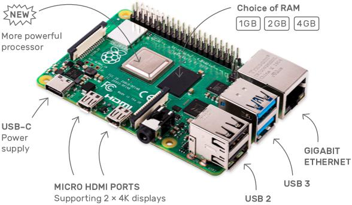
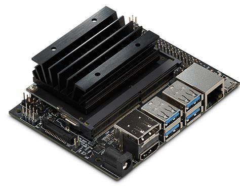

# 硬件

| 主机                                                                                 | 内存   | TF卡容量 | 数量 |
| :---                                                                                | ----:  | ----:  | ---:|
| [Raspberry Pi 4](https://www.raspberrypi.org/products/raspberry-pi-4-model-b/)      | 4G     | 32G    | 3   |
| [Jetson Nano](https://developer.nvidia.com/embedded/jetson-nano)                    | 4G     | 64G    | 1   |

## 主机
* Raspberry Pi 4（树莓派4）
    > 

* Jetson Nano
    > 

## 附件
* Micro SD卡（每个主机需要一张）
* Raspberry Pi 4（树莓派4）电源适配器   5V4A
* Jetson Nano电源适配器   5V3A
* Micro HDMI 转 HDMI 高清线（Raspberry Pi 4）
* HDMI 转 HDMI 高清线（Jetson Nano）
* 散热片（Raspberry Pi 4）
* 网线（Jetson Nano）
* 铜柱（可以用来将多个树莓派4安装到一起）
* 插排

