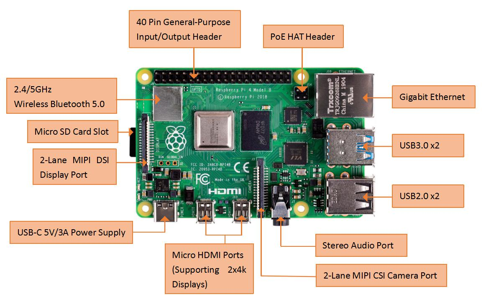
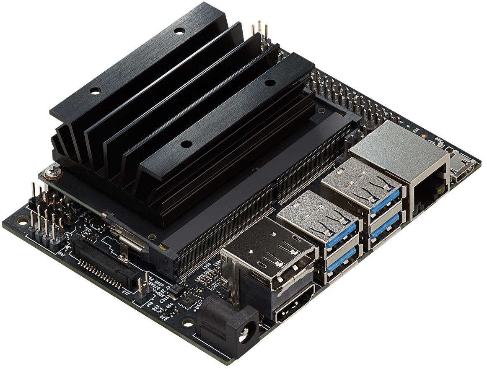
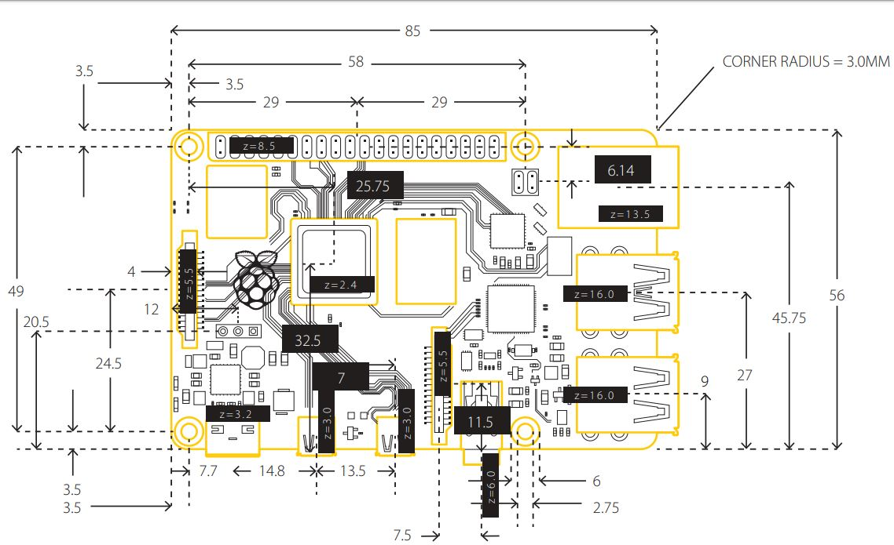
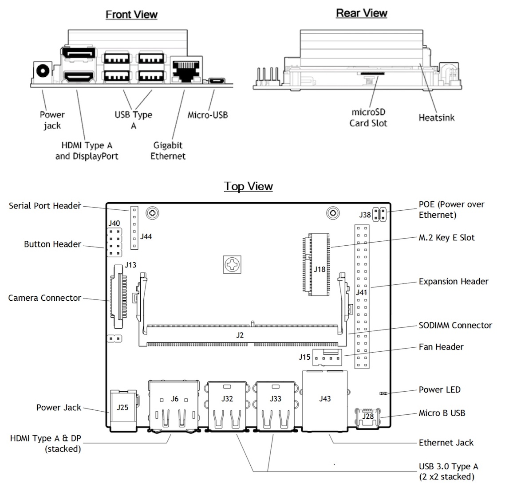
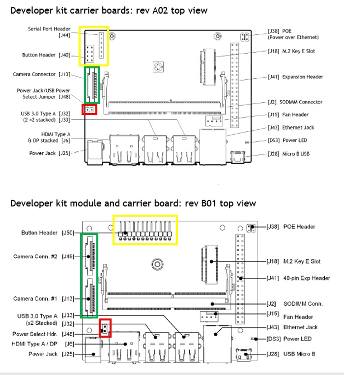

# 硬件

| 主机                                                                            | 内存   | 电源存储容量 | 适配器 | 散热片 | 高清接口  |　Wi-Fi 蓝牙 | 主机 | 用户 | 密码 |
| :---                                                                           | ----:  | ----:     | ---: | ---: | ---:      | ---: | ---: | ---:| ---: |
| 小主机 | 8G | 128G | 12V5A | 自带 | HDMI | 自带 | aiot | wjj | |
| [Raspberry Pi 4](https://www.raspberrypi.org/products/raspberry-pi-4-model-b/) | 4G     | 32G       | 5V3A | 无   | Micro HDMI | 自带 | rpi1  | pi  | raspberry |
| [Raspberry Pi 4](https://www.raspberrypi.org/products/raspberry-pi-4-model-b/) | 4G     | 32G       | 5V3A | 无   | Micro HDMI | 自带 | rpi2  | pi  | raspberry |
| [Raspberry Pi 4](https://www.raspberrypi.org/products/raspberry-pi-4-model-b/) | 4G     | 32G       | 5V3A | 无   | Micro HDMI | 自带 | rpi3  | pi  | raspberry |
| [Jetson Nano B01](https://developer.nvidia.com/embedded/jetson-nano)           | 4G     | 64G       | 5V4A | 自带 | HDMI       | 无   | nano1 | nano| jetson    |

## 主机
### Raspberry Pi 4（树莓派4）

### Jetson Nano

## 主机尺寸
### Raspberry Pi 4（树莓派4）

### Jetson Nano A02

### Jetson Nano A02和B01对比

## 附件
* 千兆路由器
* Micro SD卡（每个主机需要一张）
* Raspberry Pi 4（树莓派4）电源适配器   5V3A
* Jetson Nano电源适配器   5V4A
* Micro HDMI 转 HDMI 高清线（Raspberry Pi 4）
* HDMI 转 HDMI 高清线（Jetson Nano）
* 散热片（Raspberry Pi 4）
* 网线（Jetson Nano）
* 铜柱（可以用来将多个树莓派4安装到一起）
* 插排

## 参考资料
* [Raspberry Pi](https://www.raspberrypi.org/)
* [Jetson Hardware](https://developer.nvidia.com/embedded/develop/hardware)
* [NVIDIA Jetson Nano Development Kit-B01](https://www.seeedstudio.com/NVIDIA-Jetson-Nano-Development-Kit-B01-p-4437.html)
* [Raspberry Pi 4 B 4G Computer Board](https://www.robotshop.com/en/raspberry-pi-4-b-4g-computer-board.html)
* [Raspberry Pi 4](http://www.xiaorgeek.com/store/raspberry-pi-model-4b-pre-order.html)
* [Raspberry Pi Model B+](https://www.element14.com/community/community/raspberry-pi/raspberry-pi-bplus/blog/2014/07/14/meet-the-raspberry-pi-b)
