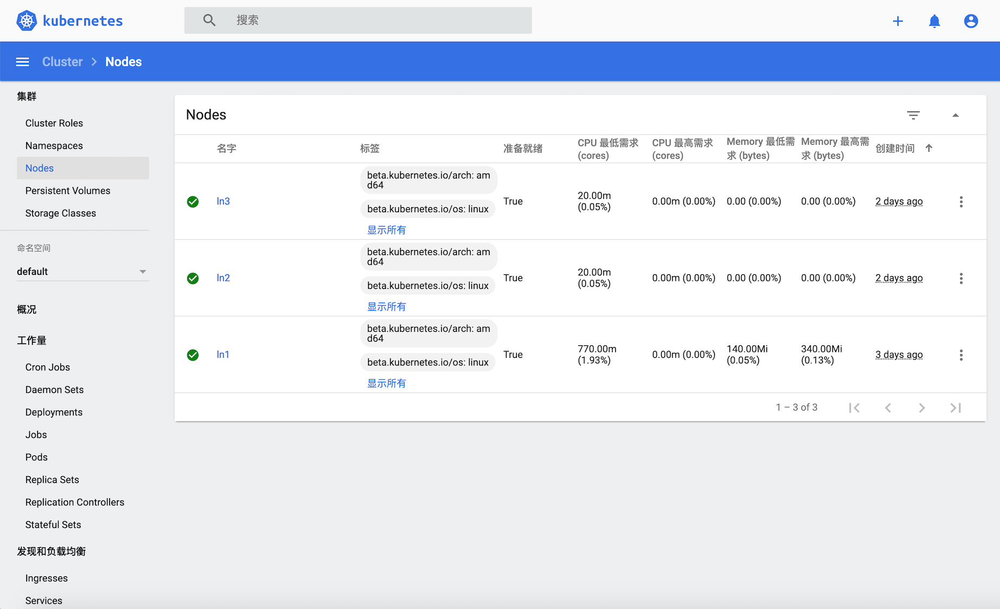

# 用户界面 Dashboard

Dashboard 是基于网页的 Kubernetes 用户界面。您可以使用 Dashboard 将容器应用部署到 Kubernetes 集群中，也可以对容器应用排错，还能管理集群资源。您可以使用 Dashboard 获取运行在集群中的应用的概览信息，也可以创建或者修改 Kubernetes 资源（如 Deployment，Job，DaemonSet 等等）。例如，您可以对 Deployment 实现弹性伸缩、发起滚动升级、重启 Pod 或者使用向导创建新的应用。



## 部署 Dashboard
```bash
sudo kubectl apply -f https://raw.githubusercontent.com/kubernetes/dashboard/v2.0.0/aio/deploy/recommended.yaml
```

## RBAC配置
为了保护您的集群数据，默认情况下，Dashboard 会使用最少的 RBAC 配置进行部署。 当前，Dashboard 仅支持使用 Bearer 令牌登录。 

编辑文件：dashboard.admin-user.yml
```bash
apiVersion: v1
kind: ServiceAccount
metadata:
  name: admin-user
  namespace: kubernetes-dashboard
```

编辑文件：dashboard.admin-user-role.yml
```bash
apiVersion: rbac.authorization.k8s.io/v1
kind: ClusterRoleBinding
metadata:
  name: admin-user
roleRef:
  apiGroup: rbac.authorization.k8s.io
  kind: ClusterRole
  name: cluster-admin
subjects:
- kind: ServiceAccount
  name: admin-user
  namespace: kubernetes-dashboard
```

创建RBAC
```bash
sudo kubectl apply -f dashboard.admin-user.yml -f dashboard.admin-user-role.yml
```

## 访问 Dashboard

获取登录 Dashboard 需要的 Token 信息。
```bash
sudo kubectl -n kubernetes-dashboard describe secret admin-user-token | grep ^token
```
输入Token信息登录。


### 命令行代理
这种方式只能在本机访问。

命令行下运行
```bash
kubectl proxy
```

浏览器输入地址 http://localhost:8001/api/v1/namespaces/kubernetes-dashboard/services/https:kubernetes-dashboard:/proxy/ 访问。

远程访问Dashboard（创建ssh隧道）
```bash
# -L 8001 本机的端口号，可以是任意。
ssh -L 8001:127.0.0.1:8001 -N -f -l <username> <kubernetes master hostname or ip> 
```

### NodePort
这种方式只推荐在开发环境下单节点安装。

编辑 ```kubernetes-dashboard``` 服务。
```bash
sudo kubectl -n kubernetes-dashboard edit service kubernetes-dashboard
```

修改内容 ```type: ClusterIP``` 为 ```type: NodePort``` ，保存文件。
```yaml
# Please edit the object below. Lines beginning with a '#' will be ignored,
# and an empty file will abort the edit. If an error occurs while saving this file will be
# reopened with the relevant failures.
#
apiVersion: v1
kind: Service
metadata:
  annotations:
    kubectl.kubernetes.io/last-applied-configuration: |
      {"apiVersion":"v1","kind":"Service","metadata":{"annotations":{},"labels":{"k8s-app":"kubernetes-dashboard"},"name":"kubernete
  creationTimestamp: "2020-05-14T08:58:29Z"
  labels:
    k8s-app: kubernetes-dashboard
  name: kubernetes-dashboard
  namespace: kubernetes-dashboard
  resourceVersion: "129620"
  selfLink: /api/v1/namespaces/kubernetes-dashboard/services/kubernetes-dashboard
  uid: 81872828-d6b4-4673-b1c1-4744e3a7659c
spec:
  clusterIP: 10.43.33.68
  externalTrafficPolicy: Cluster
  ports:
  - nodePort: 32339
    port: 443
    protocol: TCP
    targetPort: 8443
  selector:
    k8s-app: kubernetes-dashboard
  sessionAffinity: None
  type: NodePort
status:
  loadBalancer: {}
```

查看服务的端口
```bash
sudo kubectl -n kubernetes-dashboard get service kubernetes-dashboard
NAME                   TYPE       CLUSTER-IP    EXTERNAL-IP   PORT(S)         AGE
kubernetes-dashboard   NodePort   10.43.33.68   <none>        443:32339/TCP   2d
```
您会看到 Dashboard 暴露出端口 ```32339(HTTPS)```，现在可以在您的浏览器中访问```https://<master-ip>:32339```。如果您是多节点的集群，也可以使用节点IP访问，```https://<node-ip>:<nodePort>```。

## 参考资料
* [网页界面 (Dashboard)](https://kubernetes.io/zh/docs/tasks/access-application-cluster/web-ui-dashboard/)
* [Accessing Dashboard](https://github.com/kubernetes/dashboard/blob/master/docs/user/accessing-dashboard/README.md)
* [Is accessing kubernetes dashboard remotely possible?](https://www.edureka.co/community/31282/is-accessing-kubernetes-dashboard-remotely-possible)
